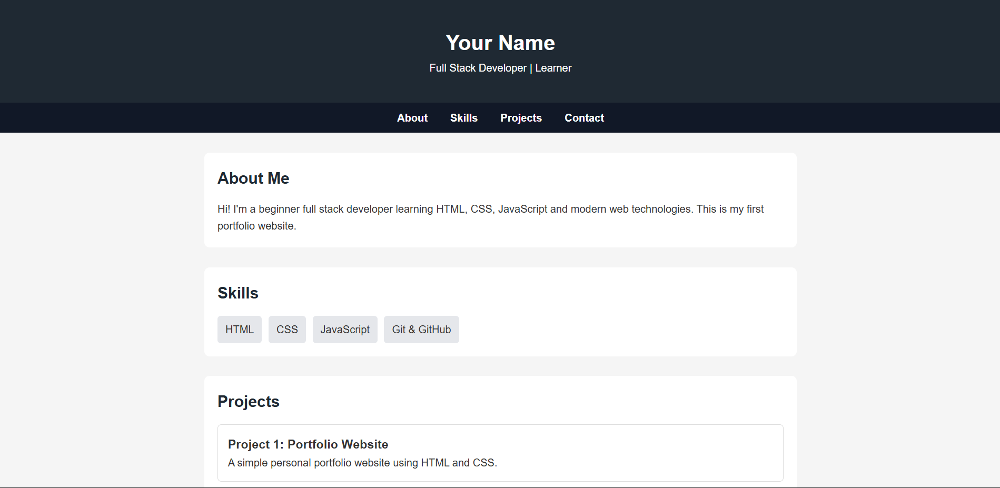
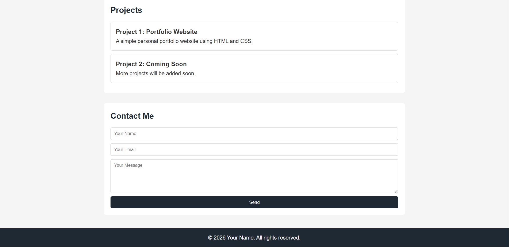

# 📁 Project 01 – Personal Portfolio Website (Static)

**Difficulty:** 🟢 Beginner
**Tech Stack:** HTML, CSS
**Estimated Time:** 2–4 hours

A simple personal portfolio website built using only HTML and CSS. This project is meant for beginners who are just starting their journey into web development. It helps you understand how a real website is structured and styled.

---

## 🎯 Objective

The goal of this project is to:

* Understand basic HTML structure
* Learn how to style pages using CSS
* Create sections like About, Skills, Projects, and Contact
* Build a clean and simple personal portfolio website

---

## 📸 Preview



---

## 🧩 Features

* Clean landing header
* Navigation bar with section links
* About section
* Skills list
* Projects section
* Contact form
* Footer

---

## 📂 Folder Structure

```
01-portfolio-html/
│
├── code/
    ├── index.html
    ├── style.css
└── README.md
```

---

## ▶️ How to Run

1. Download or clone this repository
2. Open the folder `01-portfolio-html`
3. Double click `index.html`
4. The website will open in your browser

No server or installation required.

---

## 🧠 Concepts You Will Learn

* HTML elements & structure
* Forms and inputs
* Linking CSS
* Layout with containers
* Basic responsiveness
* Styling text and sections

---

## 🛠️ Tasks (Try These Yourself)

* Change the name and bio to your own
* Add your profile image
* Add 2 more projects
* Change theme colors
* Make navbar sticky
* Improve mobile view

---

## ❗ Common Issues

* **CSS not applying?**
  Make sure `style.css` is in the same folder as `index.html`
* **Page looks broken on mobile?**
  Try adjusting padding and font sizes in CSS

---

## 🚀 Next Step

After completing this project, move to:

👉 **Project 02 – Restaurant Landing Page (HTML + CSS Layout Practice)**

---

## 🤝 Contribution

If you find any issues or want to improve this project, feel free to open a pull request.
